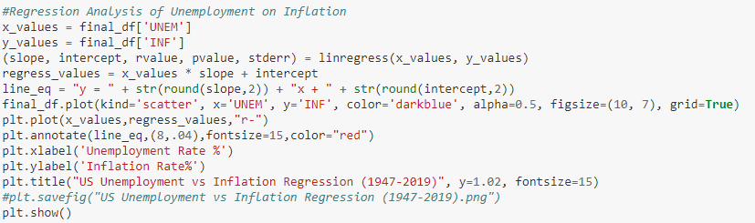

# Phillips Curve

## Introduction
The aim of our project is to establish the relationship between inflation and unemployment (the Phillips curve) in the US. We'll rely on the time series data that we have to examine the interconnectedness  between general inflation rates and unemployment rates .

In doing so, we also establish the relationship between GDP and unemployment, Okun's Law

## Collect  unemployment and gdp data using FRED and FRED api

## Create line graphs for inflation and unemployment rate

## Run regression analysis on employment vs inflation

## Run regression analysis on unemployment vs gdp 

## Programs Used:
* Jupyter Notebook
* Pandas

## Data Sources:
* https://fred.stlouisfed.org 
* FRED APIs.

